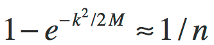
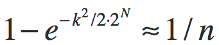
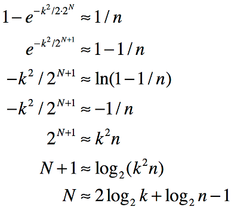

## EntropyString for JavaScript

[](https://www.npmjs.com/package/entropy-string) &nbsp; [](https://travis-ci.org/EntropyString/JavaScript) &nbsp; [](https://en.wikipedia.org/wiki/ISC_license)

Efficiently generate cryptographically strong random strings of specified entropy from various character sets.

### <a name="TOC"></a>TOC
 - [Installation](#Installation)
 - [Usage](#Usage)
 - [Overview](#Overview)
 - [Real Need](#RealNeed)
 - [More Examples](#MoreExamples)
 - [Character Sets](#CharacterSets)
 - [Custom Characters](#CustomCharacters)
 - [Efficiency](#Efficiency)
 - [Custom Bytes](#CustomBytes)
 - [No Crypto](#NoCrypto)
 - [Browser Version](#BrowserVersion)
 - [Entropy Bits](#EntropyBits)
 - [Why You Don't Need UUIDs](#UUID)
 - [Upgrading](#Upgrading)
    - [Version 3](#Upgrade3)
    - [Version 3.1](#Upgrade31)
    - [Version 4](#Upgrade4)
 - [Take Away](#TakeAway)

### <a name="Installation"></a>Installation

##### Yarn

```bash
  yarn add entropy-string
```

##### NPM

```bash
  npm install entropy-string
```

[TOC](#TOC)

### <a name="Usage"></a>Usage

##### Generate strings as an efficient replacement to using version 4 UUIDs

  ```js
  const entropy = new Entropy()
  const string = entropy.string()
  ```

  > GtTr2h4PT2mjffm2GrDN2rhpqp

See the [UUID](#UUID) section for a discussion of why the above is more efficient than using the string representation of version 4 UUIDs.

##### Generate a potential of _1 million_ random strings with _1 in a billion_ chance of repeat

  ```js
  const { Entropy } = require('entropy-string')

  const entropy = new Entropy({ total: 1e6, risk: 1e9 })
  const string = entropy.string()
  ```

  > pbbnBD4MQ3rbRN

See [Real Need](#RealNeed) for description of what the `total` and `risk` parameters represent.

##### Hexidecimal strings

`EntropyString` uses predefined `charset32` characters by default (see [Character Sets](#CharacterSets)). To get a random hexadecimal string:

  ```js
  const { Entropy, charset16 } = require('entropy-string')

  const entropy = new Entropy({ total: 1e6, risk: 1e9, charset: charset16 })
  const string = entropy.string()
  ```

  > 878114ac513a538e22

##### Custom characters

Custom characters may also be specified. Using uppercase hexadecimal characters:

  ```js
  const { Entropy } = require('entropy-string')

  const entropy = new Entropy({ total: 1e6, risk: 1e9, charset: '0123456789ABCDEF' })
  const string = entropy.string()
  ```

  > 16E26779479356B516

##### Convenience functions

Convenience functions `smallID`, `mediumID`, `largeID`, `sessionID` and `token` provide random strings for various predefined bits of entropy. For example, a small id represents a potential of 30 strings with a 1 in a million chance of repeat:

  ```js
  const { Entropy } = require('entropy-string')

  const entropy = new Entropy()
  const string = entropy.smallID()
  ```

  > DpTQqg

Or, to generate an OWASP session ID:

  ```js
  const { Entropy } = require('entropy-string')

  const entropy = new Entropy()
  const string = entropy.sessionID()
  ```

  > nqqBt2P669nmjPQRqh4NtmTPn9

Or perhaps you need an 256-bit token using [RFC 4648](https://tools.ietf.org/html/rfc4648#section-5) file system and URL safe characters:
  ```js
  const { Entropy, charset64} = require('entropy-string')

  const entropy = new Entropy({ charset: charset64 })
  const string = entropy.token()
  ```

  > t-Z8b9FLvpc-roln2BZnGYLZAX_pn5U7uO_cbfldsIt

#### Examples

Run any of the examples in the `examples` directory by:

  ```bash
  yarn examples
  node examples/dist/tldr_1.js
  ```

[TOC](#TOC)

### <a name="Overview"></a>Overview

`EntropyString` provides easy creation of randomly generated strings of specific entropy using various character sets. Such strings are needed as unique identifiers when generating, for example, random IDs and you don't want the overkill of a UUID.

A key concern when generating such strings is that they be unique. Guaranteed uniqueness, however, requires either deterministic generation (e.g., a counter) that is not random, or that each newly created random string be compared against all existing strings. When randomness is required, the overhead of storing and comparing strings is often too onerous and a different tack is chosen.

A common strategy is to replace the **_guarantee of uniqueness_** with a weaker but often sufficient one of **_probabilistic uniqueness_**. Specifically, rather than being absolutely sure of uniqueness, we settle for a statement such as *"there is less than a 1 in a billion chance that two of my strings are the same"*. We use an implicit version of this very strategy every time we use a hash set, where the keys are formed from taking the hash of some value. We *assume* there will be no hash collision using our values, but we **do not** have any true guarantee of uniqueness per se.

Fortunately, a probabilistic uniqueness strategy requires much less overhead than guaranteed uniqueness. But it does require we have some manner of qualifying what we mean by *"there is less than a 1 in a billion chance that 1 million strings of this form will have a repeat"*.

Understanding probabilistic uniqueness of random strings requires an understanding of [*entropy*](https://en.wikipedia.org/wiki/Entropy_(information_theory)) and of estimating the probability of a [*collision*](https://en.wikipedia.org/wiki/Birthday_problem#Cast_as_a_collision_problem) (i.e., the probability that two strings in a set of randomly generated strings might be the same). The blog post [Hash Collision Probabilities](http://preshing.com/20110504/hash-collision-probabilities/) provides an excellent overview of deriving an expression for calculating the probability of a collision in some number of hashes using a perfect hash with an N-bit output. This is sufficient for understanding the probability of collision given a hash with a **fixed** output of N-bits, but does not provide an answer to qualifying what we mean by *"there is less than a 1 in a billion chance that 1 million strings of this form will have a repeat"*. The [Entropy Bits](#EntropyBits) section below describes how `EntropyString` provides this qualifying measure.

We'll begin investigating `EntropyString` by considering the [Real Need](#RealNeed) when generating random strings.

[TOC](#TOC)

### <a name="RealNeed"></a>Real Need

Let's start by reflecting on the common statement: *I need random strings 16 characters long.*

Okay. There are libraries available that address that exact need. But first, there are some questions that arise from the need as stated, such as:

  1. What characters do you want to use?
  2. How many of these strings do you need?
  3. Why do you need these strings?

The available libraries often let you specify the characters to use. So we can assume for now that question 1 is answered with:

*Hexadecimal will do fine*.

As for question 2, the developer might respond:

*I need 10,000 of these things*.

Ah, now we're getting somewhere. The answer to question 3 might lead to a further qualification:

*I need to generate 10,000 random, unique IDs*.

And the cat's out of the bag. We're getting at the real need, and it's not the same as the original statement. The developer needs *uniqueness* across a total of some number of strings. The length of the string is a by-product of the uniqueness, not the goal, and should not be the primary specification for the random string.

As noted in the [Overview](#Overview), guaranteeing uniqueness is difficult, so we'll replace that declaration with one of *probabilistic uniqueness* by asking a fourth question:

<ol start=4>
  <li>What risk of a repeat are you willing to accept?</li>
</ol>

Probabilistic uniqueness contains risk. That's the price we pay for giving up on the stronger declaration of guaranteed uniqueness. But the developer can quantify an appropriate risk for a particular scenario with a statement like:

*I guess I can live with a 1 in a million chance of a repeat*.

So now we've finally gotten to the developer's real need:

*I need 10,000 random hexadecimal IDs with less than 1 in a million chance of any repeats*.

Not only is this statement more specific, there is no mention of string length. The developer needs probabilistic uniqueness, and strings are to be used to capture randomness for this purpose. As such, the length of the string is simply a by-product of the encoding used to represent the required uniqueness as a string.

How do you address this need using a library designed to generate strings of specified length?  Well, you don't, because that library was designed to answer the originally stated need, not the real need we've uncovered. We need a library that deals with probabilistic uniqueness of a total number of some strings. And that's exactly what `EntropyString` does.

Let's use `EntropyString` to help this developer generate 5 hexadecimal IDs from a pool of a potential 10,000 IDs with a 1 in a million chance of a repeat:

  ```js
  const { Entropy, charset16 } = require('entropy-string')
  const entropy = new Entropy({ total: 10000, risk: 1000000, charset: charset16 })
  const strings = Array(5).fill('').map(e => entropy.string())
  ```

  > ["85e442fa0e83", "a74dc126af1e", "368cd13b1f6e", "81bf94e1278d", "fe7dec099ac9"]

Examining the above code, the `total` and `risk` parameters specify how much entropy is needed to satisfy the probabilistic uniqueness of generating a potential total of **10,000** strings with a **1 in a million** risk of repeat. The `charset` parameter specifies the characters to use. Finally, the strings themselves are generated using `entropy.string()`.

Looking at the IDs, we can see each is 12 characters long. It seems the developer didn't really need 16 characters after all. Again, the string length is a by-product of the characters used to represent the randomness (i.e. entropy) we needed. The strings would be shorter if we used either a 32 or 64 character set.

[TOC](#TOC)

### <a name="MoreExamples"></a>More Examples

In [Real Need](#RealNeed) our developer used hexadecimal characters for the strings.  Let's look at using other characters instead.

We'll start with using 32 characters. What 32 characters, you ask? The [Character Sets](#CharacterSets) section discusses the predefined characters available in `EntropyString` and the [Custom Characters](#CustomCharacters) section describes how you can use whatever characters you want. By default, `EntropyString` uses `charset32` characters, so we don't need to pass that parameter into `new Entropy()`.

  ```js
  const { Entropy } = require('entropy-string')

  const entropy = new Entropy({ total: 10000, risk: 1e6 })
  const string = entropy.string()
  ```

  > String: MD8r3BpTH3

We're using the same `total` and `risk` as before, but this time we use 32 characters and our resulting ID are 10 characters.

As another example, let's assume we need to ensure the names of about 30 items are unique. And suppose we decide we can live with a 1 in 100,000 probability of collision (we're just futzing with some coding ideas). Using the predefined provided hex characters:

  ```js
  const { Entropy, charset16, charset4 } = require('entropy-string')

  const entropy = new Entropy({ total: 30, risk: 100000, charset: charset16 })
  const string = entropy.string()
  ```

  > String: dbf40a6

Using the same `Entropy` instance, we can switch to the predefined `charset4` characters and generate a string with those characters and the same amount of entropy:

  ```js
  entropy.use(charset4)
  string = entropy.string()
  ```

  > String: CAATAGTGGACTG

Okay, we probably wouldn't use 4 characters (and what's up with those characters?), but you get the idea.

Suppose we have a more extreme need. We want less than a 1 in a trillion chance that 10 billion base 32 strings repeat. Let's see, our total of 10 billion is 10<sup>10</sup> and our risk of 1 in a trillion is 10<sup>12</sup>, so:

  ```js
  const { Entropy } = require('entropy-string')

  const entropy = new Entropy({ total: 1e10, risk: 1e12 })
  const string = entropy.string()
  ```

   > String: 4J86pbFG9BqdBjTLfD3rt6

Finally, let say we're generating session IDs. Since session IDs are ephemeral, we aren't interested in uniqueness per se, but in ensuring our IDs aren't predictable since we can't have the bad guys guessing a valid session ID. In this case, we're using entropy as a measure of unpredictability of the IDs. Rather than calculate our entropy, we declare it as 128 bits (since we read on the OWASP web site that session IDs should be 128 bits).

  ```js
  const { Entropy } = require('entropy-string')

  const entropy = new Entropy({ bits: 128 })
  const string = entropy.string()
  ```

  > String: Rm9gDFn6Q9DJ9rbrtrttBjR97r

Since session ID are such an important need, `EntropyString` provides a convenience function for generating them:

  ```js
  const { Entropy, charset64 } = require('entropy-string')

  const entropy = new Entropy({ charset: charset64 })
  const string = entropy.sessionID()
  ```

  > String: DUNB7JHqXCibGVI5HzXVp2

[TOC](#TOC)

### <a name="CharacterSets"></a>Character Sets

As we've seen in the previous sections, `EntropyString` provides predefined character sets. Let's see what's under the hood.

  ```js
  const { charset64 } = require('entropy-string')
  const chars = charset64.chars()
  ```

  > ABCDEFGHIJKLMNOPQRSTUVWXYZabcdefghijklmnopqrstuvwxyz0123456789-_

The available `CharSet`s are *charset64*, *charset32*, *charset16*, *charset8*, *charset4* and *charset2*. The predefined characters for each were chosen as follows:

  - `charset64`: **ABCDEFGHIJKLMNOPQRSTUVWXYZabcdefghijklmnopqrstuvwxyz0123456789-_**
      * The file system and URL safe char set from [RFC 4648](https://tools.ietf.org/html/rfc4648#section-5).
      &nbsp;
  - `charset32`: **2346789bdfghjmnpqrtBDFGHJLMNPQRT**
      * Remove all upper and lower case vowels (including y)
      * Remove all numbers that look like letters
      * Remove all letters that look like numbers
      * Remove all letters that have poor distinction between upper and lower case values.
      &nbsp;
  - `charset16`: **0123456789abcdef**
      * Hexadecimal
      &nbsp;
  - `charset8`: **01234567**
      * Octal
      &nbsp;
  - `charset4`: **ATCG**
      * DNA alphabet. No good reason; just wanted to get away from the obvious.
      &nbsp;
  - `charset2`: **01**
      * Binary

The default `CharSet` is `charset32`. The random strings using the characters of that set result in strings don't look like English words and yet are easy to parse visually.

You may, of course, want to choose the characters used, which is covered next in [Custom Characters](#CustomCharacters).

[TOC](#TOC)

### <a name="CustomCharacters"></a>Custom Characters

Being able to easily generate random strings is great, but what if you want to specify your own characters. For example, suppose you want to visualize flipping a coin to produce entropy of 10 bits.

  ```js
  const { Entropy, charset2 } = require('entropy-string')

  const entropy = new Entropy({ charset: charset2, bits: 10 })
  let flips = entropy.string()
  ```

  > flips: 1111001011

The resulting string of __0__'s and __1__'s doesn't look quite right. Perhaps you want to use the characters __H__ and __T__ instead.

  ```js
  entropy.useChars('HT')
  flips = entropy.string()
  ```

  > flips: THHTHTTHHT

As another example, we saw in [Character Sets](#CharacterSets) the predefined hex characters for `charset16` are lowercase. Suppose you like uppercase hexadecimal letters instead.

  ```js
  const { Entropy } = require('entropy-string')

  const entropy = new Entropy({ charset: '0123456789ABCDEF', bits: 48 })
  const string = entropy.string()
  ```

  > string: 08BB82C0056A

The `Entropy` constructor allows for the following cases:

  - No argument:
    - `charset32` characters and 128 `bits`
  - { total: **T**, risk: **R** }:
    - `charset32` characters and sufficient `bits` to ensure a potential of **T** strings with a risk of repeat being **1 in R**
  - { bits: **N** }:
    - `charset32` characters and **N** `bits`
  - { charset: `CharSet` }:
    - One of six predefined `CharSet`s can be specified
  - { charset: **chars** }:
    - A string representing the characters to use can be specified
  - A combination of `charset` and either `bits` or `total`,`risk`

If a string of characters is used, an `EntropyStringError` will be thrown if the characters aren't appropriate for creating a valid `CharSet`.
  ```js
  const { Entropy } = require('entropy-string')

  try {
    const entropy = new Entropy({ charset: '123456' })
  }
  catch(error) {
    console.log(error.message)
  }
  ```

  > Invalid character count: must be one of 2,4,8,16,32,64

  ```js
  try {
    const entropy = new Entropy({ charset: '01233210' })
  }
  catch(error) {
    console.log(error.message)
  }
  ```

  > Characters not unique

[TOC](#TOC)

### <a name="Efficiency"></a>Efficiency

To efficiently create random strings, `EntropyString` generates the necessary number of bytes needed for each string and uses those bytes in a bit shifting scheme to index into a character set. For example, consider generating strings from the `charset32` character set. There are __32__ characters in the set, so an index into an array of those characters would be in the range `[0,31]`. Generating a random string of `charset32` characters is thus reduced to generating a random sequence of indices in the range `[0,31]`.

To generate the indices, `EntropyString` slices just enough bits from the array of bytes to create each index. In the example at hand, 5 bits are needed to create an index in the range `[0,31]`. `EntropyString` processes the byte array 5 bits at a time to create the indices. The first index comes from the first 5 bits of the first byte, the second index comes from the last 3 bits of the first byte combined with the first 2 bits of the second byte, and so on as the byte array is systematically sliced to form indices into the character set. And since bit shifting and addition of byte values is really efficient, this scheme is quite fast.

The `EntropyString` scheme is also efficient with regard to the amount of randomness used. Consider the following common JavaScript solution to generating random strings. To generate a character, an index into the available characters is create using `Math.random`. The code looks something like:

  ```js
  const chars = "ABCDEFGHIJKLMNOPQRSTUVWXYZabcdefghijklmnopqrstuvwxyz0123456789"
  let string = ""
  for(let i = 0; i < length; i++) {
    string += chars.charAt(Math.floor(Math.random() * chars.length));
  }
  ```

  > bl0mvxXAqXuz5R3N

There are two significant issues with this code. `Math.random` returns a random `float` value. At the very best this value has about 53-bits of entropy. Let's assume it's 52-bits for argument sake, i.e. `Math.random` generates 52 bits of randomness per call. That randomness is in turn used to create an index into the 62 **chars**, each which represents 5.95 bits of entropy. So if we're creating strings with **length=16**, the 16 calls generate a total of `16*52 = 816` bits of randomness which are used to inject a total of 95.2 bits of entropy (5.95/char) into **string**. That means 720 bits (88% of the total) of the generated randomness is simply wasted.

Compare that to the `EntropyString` scheme. For the example above, slicing off 5 bits at a time requires a total of 80 bits (10 bytes). Creating the same strings as above, `EntropyString` uses 80 bits of randomness per string with no wasted bits. In general, the `EntropyString` scheme can waste up to 7 bits per string, but that's the worst case scenario and that's *per string*, not *per character*!

  ```js
  const { Entropy } = require('entropy-string')

  const entropy = new Entropy({ bits: 80 })
  let string = entropy.string()
  ```

  > HFtgHQ9q9fH6B8HM

But there is an even bigger issue with the previous code from a security perspective. `Math.random` *is not a cryptographically strong random number generator*. **_Do not_** use `Math.random` to create strings used for security purposes! This highlights an important point. Strings are only capable of carrying information (entropy); it's the random bytes that actually provide the entropy itself. `EntropyString` automatically generates the necessary bytes needed to create cryptographically strong random strings using the `crypto` library.

However, if you don't need cryptographically strong random strings, you can request `EntropyString` use the psuedo-random number generator (PRNG) `Math.random` rather than the `crypto` library by using passing the param `prng: true` to the `Entropy` constructor:

  ```js
  const { Entropy } = require('entropy-string')

  const entropy = new Entropy({ bits: 80, prng: true })
  string = entropy.string()
  ```

  > fdRp9Q3rTMF7TdFN

When using `Math.random`, the `EntropyString` scheme uses 48 of the 52(ish) bits of randomness from each call to `Math.random`. That's much more efficient than the previous code snippet but a bit less so than using bytes from `crypto`. And of course, being a PRNG, `Math.random` yields a deterministic sequence.

Fortunately you don't need to really understand how the bytes are efficiently sliced and diced to get the string. But you may want to provide your own [Custom Bytes](#CustomBytes) to create a string, which is the next topic.

[TOC](#TOC)

### <a name="CustomBytes"></a>Custom Bytes

As described in [Efficiency](#Efficiency), `EntropyString` automatically generates random bytes using the `crypto` library. But you may have a need to provide your own bytes, say for deterministic testing or to use a specialized byte generator. The `entropy.string` function allows passing in your own bytes to create a string.

Suppose we want a string capable of 30 bits of entropy using 32 characters. We pass in 4 bytes to cover the 30 bits needed to generate six base 32 characters:

  ```js
  const { Entropy } = require('entropy-string')

  const entropy = new Entropy()
  const bytes = Buffer.from([250, 200, 150, 100])
  let string = entropy.stringWithBytes(30, bytes)
  ```

  > Th7fjL

The __bytes__ provided can come from any source. However, the number of bytes must be sufficient to generate the string as described in the [Efficiency](#Efficiency) section.  `entropy.stringWithBytes` throws an `Error` if the string cannot be formed from the passed bytes.

  ```js
  try {
    string = entropy.stringWithBytes(32, bytes)
  }
  catch(error) {
    console.log('  Error: ' + error.message)
  }
  ```

  > error: Insufficient bytes: need 5 and got 4

Note the number of bytes needed is dependent on the number of characters in our set. In using a string to represent entropy, we can only have multiples of the bits of entropy per character used. So in the example above, to get at least 32 bits of entropy using a character set of 32 characters (5 bits per char), we'll need enough bytes to cover 35 bits, not 32, so an `Error` is thrown.

[TOC](#TOC)

### <a name="NoCrypto"></a>No Crypto

By default, `EntropyString` uses the `crypto` library for the cryptographically strong random bits used to systematically index into the chosen character set. If cryptographically strong strings are not required, `EntropyString` can use the psuedo-random number generator `Math.random` by passing `prng: true` to the `Entropy` constructor:

```js
const { Entropy } = require('entropy-string')

const entropy = new Entropy({ total: 1e5, risk: 1e7, prng: true })
const string = entropy.string()
```

> MJNhBg842J6

[TOC](#TOC)

### <a name="BrowserVersion"></a>Browser Version

A browser version of `EntropyString` is packaged as a UMD bundle in the file `entropy-string.browser.js` with an export name of __EntropyString__ . Rather than use the `crypto` library, the browser version uses `window.crypto.getRandomValues` for generating random bits. See `examples/browser.html` for example usage.

[TOC](#TOC)

### <a name="EntropyBits"></a>Entropy Bits

Thus far we've avoided the mathematics behind the calculation of the entropy bits required to specify a risk that some number random strings will not have a repeat. As noted in the [Overview](#Overview), the posting [Hash Collision Probabilities](http://preshing.com/20110504/hash-collision-probabilities/) derives an expression, based on the well-known [Birthday Problem](https://en.wikipedia.org/wiki/Birthday_problem#Approximations), for calculating the probability of a collision in some number of hashes (denoted by `k`) using a perfect hash with an output of `M` bits:



There are two slight tweaks to this equation as compared to the one in the referenced posting. `M` is used for the total number of possible hashes and an equation is formed by explicitly specifying that the expression in the posting is approximately equal to `1/n`.

More importantly, the above equation isn't in a form conducive to our entropy string needs. The equation was derived for a set number of possible hashes and yields a probability, which is fine for hash collisions but isn't quite right for calculating the bits of entropy needed for our random strings.

The first thing we'll change is to use `M = 2^N`, where `N` is the number of entropy bits. This simply states that the number of possible strings is equal to the number of possible values using `N` bits:



Now we massage the equation to represent `N` as a function of `k` and `n`:



The final line represents the number of entropy bits `N` as a function of the number of potential strings `k` and the risk of repeat of 1 in `n`, exactly what we want. Furthermore, the equation is in a form that avoids really large numbers in calculating `N` since we immediately take a logarithm of each large value `k` and `n`.

[TOC](#TOC)

### <a name="UUID"></a>Why You Don't Need UUIDs

It is quite common in most (all?) programming languages to simply use string representations of UUIDs as random strings. While this isn't necessarily wrong, it is not efficient. It's somewhat akin to using a BigInt library to do math with small integers. The answers might be right, but the process seems wrong.

By UUID, we almost always mean the version 4 string representation, which looks like this:

```
  hhhhhhhh-hhhh-4hhh-Hhhh-hhhhhhhhhhhh
```

Per [Section 4.4 of RFC 4122](https://tools.ietf.org/html/rfc4122#section-4.4), the algorithm for creating 32-byte version 4 UUIDs is:

  - Set bits 49-52 to the 4-bit version number, **0100**
    - The 13th hex char will always be **4**
  - Set bit 65-66 to **10**.
    - The 17th hex char will be one of **8**, **9**, **A** or **B**
  - Set all the other bits to randomly (or pseudo-randomly) chosen values

The algorithm designates how to create the 32 byte UUID. The string representation shown above is specified in Section 3 of the RFC.

The ramifications of the algorithm and string representation are:

  - The specification does not require the use of a cryptographically strong pseudo-random number generator. That's fine, but if using the IDs for security purposes, be sure a CSPRNG is being used to generate the random bytes for the UUID.
  - Because certain bits are fixed values, the entropy of the UUID is reduced from 128 bits to 122 bits. This may not be a significant issue in some cases, but regardless of how often you read otherwise, a version 4 UUID **_does not have_** 128 bits of randomness. And if you use version 4 UUIDs for session IDs, that does not cover the OWASP recommendation of using 128-bit IDs.
  - The string representation with hyphens adds overhead without adding any bits of entropy.

As a quick aside, let me emphasize that a string **_does not_** inherently possess any given amount of entropy. For example, how many bits of entropy does the version 4 UUID string **7416179b-62f4-4ea1-9201-6aa4ef920c12** have? Given the structure of version 4 UUIDs, we know it represents **_at most_** 122 bits of entropy. But without knowing how the bits were actually generated, **_we can't know_** how much entropy has actually been captured. Consider that statement carefully if you ever look at one of the many libraries that claim to calculate the entropy of a given string. The underlying assumption of how the string characters are generated is crucial (and often glossed over). Buyer beware.

Now, back to why you don't need to use version 4 UUIDs. The string representation is fixed, and uses 36 characters. Suppose we define as a metric of efficiency the number of bits in the string representation as opposed to the number of entropy bits. Then for a version 4 UUID we have:

  - UUID
    - Entropy bits: 122
    - String length: 36
    - String bits: 288
    - Efficiency: 42%

Let's create a 122 entropy bit string using `charset64`:
  ```js
  const { Entropy, charset64} = require('entropy-string')

  const entropy = new Entropy({ bits: 122, charset: charset64 })
  const string = entropy.string()
  ```

  - Entropy String:
    - Entropy bits: 126
    - String length: 21
    - String bits: 168
    - Efficiency: 75%

Using `charset64` characters, we create a string representation with 75% efficiency vs. the 42% achieved in using version 4 UUIDs. Given that generating random strings using `EntropyString` is as easy as using a UUID library, I'll take 75% efficiency over 42% any day.

(Note the actually bits of entropy in the string is 126. Each character in `charset64` carries 6 bits of entropy, and so in this case we can only have a total entropy of a multiple of 6. The `EntropyString` library ensures the number of entropy bits will meet or exceed the designated bits.)

But that's not the primary reason for using `EntropyString` over UUIDs. With version 4 UUIDs, the bits of entropy is fixed at 122, and you should ask yourself, "why do I need 122 bits"? And how often do you unquestioningly use one-size fits all solutions anyway?

What you should actually ask is, "how many strings do I need and what level of risk of a repeat am I willing to accept"? Rather than one-size fits all solutions, you should seek understanding and explicit control. Rather than swallowing 122-bits without thinking, investigate your real need and act accordingly. If you need IDs for a database table that could have 1 million entries, explicitly declare how much risk of repeat you're willing to accept. 1 in a million? Then you need 59 bits. 1 in a billion? 69 bits. 1 in a trillion? 79 bits. But **_openly declare_** and quit using UUIDs just because you didn't think about it! Now you know better, so do better :)

And finally, don't say you use version 4 UUIDs because you don't **_ever_** want a repeat. The term 'unique' in the name is misleading. Perhaps we should call them PUID for probabilistically unique identifiers. (I left out "universal" since that designation never really made sense anyway.) Regardless, there is a chance of repeat. It just depends on how many UUIDs you produce in a given "collision" context. Granted, it may be small, but it **_is not zero_**! It's just a probability that you didn't explicitly specify and may not even have really understood.

[TOC](#TOC)

### <a name="Upgrading"></a>Upgrading

#### <a name="Upgrade3"></a>Version 3

EntropyString version 3 does not introduce any new functionality. The sole purpose of the version 3 release is to simplify and tighten the API. Backward incompatible changes made in this effort necessitated a semantic major release.

The two major changes are:

   - Replace class `EntropyString.Random` with class `EntropyString.Entropy` <br/>
   - Replace all camelCase `charSetNN` with `charsetNN` <br/>

##### Change: EntropyString.Random -> EntropyString.Entropy

Change all instances of `new Random()` to `new Entropy()`

For example,

```js
  const { Random } = require('entropy-string')
  const random = new Random()
  const string = random.sessionID()
```

becomes

```js
  const { Entropy } = require('entropy-string')
  const random = new Entropy()
  const string = random.sessionID()
```

or

```js
  const { Entropy } = require('entropy-string')
  const entropy = new Entropy()
  const string = entropy.sessionID()
```

##### Change: `charSetNN` -> `charsetNN`

Change all occurrences of `charSetNN` to `charsetNN`. `charset` is common enough in programming circles to negate the need for camelCase.

For example,

```js
  const { Random, charSet64 } = require('entropy-string')
  const random = new Random(charSet64)
  const string = random.sessionID()
```

becomes

```js
  const { Entropy, charset64 } = require('entropy-string')
  const entropy = new Entropy(charset64)
  const string = entropy.sessionID()
```

##### Other minor changes:

  - Remove `bitsWithRiskPower` and `bitsWithPowers` from `Entropy`
  - Move predefined `CharSet` declarations from `CharSet` to `Entropy`
  - `Entropy.bits` is a class method of the new `Entropy` class

#### <a name="Version31"></a>Version 3.1

Version 3.1 introduced a new Entropy constructor API which tracks the specified entropy bits at the Entropy class level. This allows generating strings without passing the bits into the `Entropy.string` function. As example, consider the previous version 3.0 code:

  ```js
  const { Entropy } = require('entropy-string')
  const bits = Entropy.bits(1e6, 1e12)
  const entropy = new Entropy()
  const string = entropy.string(bits)
  ```

Using the new version 3.1 API, that code becomes:

  ```js
  const { Entropy } = require('entropy-string')
  const entropy = new Entropy({ total: 1e6, risk: 1e12 })
  const string = entropy.string()
  ```

#### <a name="Upgrade4"></a>Version 4

Version 4 changes:

  - `Entropy` constructor argument must be valid params
    - Embed `CharSet` or character string in params object using `{ charset: XYZ }`
  - Default `Entropy` constructor params object is `{ bits: 128, charset: charset32 }`
    - Default behavior is the same as version 3.x
  - Remove method `stringPRNG` and deprecated method `stringRandom`
    - `Entropy` constructor param `{ prng: true }` forces the `Entropy.string()` method to use `Math.random` generated bytes
  - Change signature of method `stringWithBytes(bitLen, bytes, <charset>)` to `stringWithBytes(bytes, <bitLen>, <charset>)` (i.e., `bitLen` defaults to the `Entropy` class setting)
    - This change is parallel to the version 3.1 change to `Entropy.string()` but required a semantic major version upgrade to implement

[TOC](#TOC)

### <a name="TakeAway"></a>Take Away

  - Don't specify randomness using string length
    - String length is a by-product, not a goal
  - Don't require truly uniqueness
    - You'll do fine with probabilistically uniqueness
  - Probabilistic uniqueness involves risk
    - Risk is specified as *"1 in __n__ chance of generating a repeat"*
  - Explicity specify your intent
    - Specified entropy as the risk of repeat in a total number of strings
  - Characters used are arbitrary
  - You need `EntropyString`, not UUIDs

##### 10 million strings with a 1 in a trillion chance of a repeat:

```js
  const { Entropy } = require('entropy-string')

  const entropy = new Entropy({ total: 1e7, risk: 1e12 })
  const string = entropy.string()
  ```

  > FrHbt3n9tBNTFMP6n

[TOC](#TOC)
